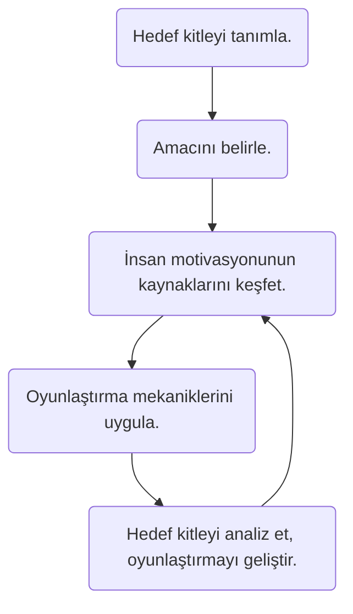

# Yepyeni Bir TV+

Turkcell'in video/film izleme platformu olan TV+'ın, 77 üniversite öğrencisi ile yaptığımız ankette %10.4 ile Türk rakipleri olan Blu TV, puhu TV ve Digiturk Play'e göre daha fazla kullanıcıya sahip olduğu görülmüştür. Ancak kullanım sırasında kendisinden önce gelen global rakiplerinin (özellikle %88.3 ile Netflix'in) çokça arkasında kalmıştır. Netflix'in global reklam anlayışı, kulaktan kulağa yayılma politikası ve içerik zenginliği ona bu başarıyı sağlamış olabilir. Çoğunlukla mobil kullanıcıların oluşturduğu (%39) bu ekosistemde hizmetlere verilen ücret en yüksek oranda (%35) 30₺ - 39₺ dir. Premium TV+ paketi ile Turkcell bu konuda anketteki katılımcılarının **"hizmete layık gördüğü" ücret olan 20₺ - 29₺** arasındaki kulvara girmekte ve kullanıcıları tatmin etmektedir.

Anketimizdeki bir diğer araştırma konusu olan "Sizin için hangisi daha önceliklidir?" sorusunda %53.3 ile daha fazla film veya dizi istenildiği ortaya çıkmıştır. Kullanıcılar **daha uygun bir ücret vermeyi** (%36.4), **içerik zenginliğinden sonra düşünmektedirler.** Hatta öyle ki, kullanıcılara yönelttiğimiz "Kullandığınız ücretli video platformuna üye  olmaya sizi iten şey neydi?" sorusuna "Sevdiğim bir içeriğin platformda olduğunu öğrenmem" cevabı baskın bir şekilde geri kalanları elemiştir. Bu cevap şaibeli görülebilir, bilmedikleri veya farklı bir platformda çıkmamış bir içeriği sevme ihtimalleri tartışılabilir ki bu içeriği izlemek için para vermeyi göze aldıklarını düşündüğümüzde. Ancak bunu yasal olmayan korsan sitelerde ilgili dizilerin paylaşılması ve hak sahibinin sessiz kalması üzerine gençlerdeki o dizinin popülaritesinin artması da bir kaynak gösterilebilir. Bunu en iyi yapan şirket Netflix'tir.

Benim asıl sunumumun da içeriği olan "Birlikte İzleme" özelliğine kullanıcıların bakış açısı %84.4 ile **olumlu** olmuştur. Bu her 5 kullanıcıdan 4'ünün bu özelliği kullanmak istediğini ve (dolaylı olarak) bu özelliği paylaşma potansiyeli olduğunu göstermektedir. Buna ek olarak işleyeceğim bir diğer özellik olan **Oyunlaştırma** kavramı ve kuramı ile ilgili sorumuz olan "İzlediğiniz video sayısına göre puan kazanmak ve bu puanlarınızı indirimler için kullanmak ister miydiniz?" kısmına en çok verilen cevap %90.9 oranında izledikleri video sayısına bağlı olarak indirim kazanmak şeklinde olmuştur. Bu da kullanıcıların içerikleri tüketirken kendilerine bir amaç aradıklarını ve bu amacı kullanarak _bizlerin_ indirim, hediye ve sıralamalar gibi bir çok diğer unsur yaratarak onları daha fazla ekranda tutabileceğimizi göstermiştir.

Anketin detaylarına ulaşmak için [bu bağlantıyı](https://dar.vin/arastirmaSonuclari) kullanabilirsiniz.

## Birlikte İzleme Özelliği

Birlikte izleme özelliği, bir grup kullanıcının aynı videoyu düşük hata payı ile _neredeyse_ aynı anda izlemesi olarak tanımlanmaktadır. Bu özellik dokümanın yazıldığı tarih olan 21 Kasım'a kadar hiçbir video platformu tarafından içerilmemektedir. Ancak 2018 yılında GitHub'da da kodları yayınlanmış ve Samual Maddock adlı kullanıcı tarafından oluşturulmuş MetaStream adı ile yayınlanmıştır. Bu da göstermektedir ki ileride bu durum popülerleşecek ve neredeyse her video platformu tarafından desteklenmesi ile sonuçlanacaktır. Özellikle COVID-19'un hayatımıza girmesinden beridir sinemalar ve tiyatroların kapandığı düşünüldüğünde rakip şirketlerce bu çözümün getirilmesi çok geç olmayacaktır.

TV+'a önerimiz, bu özelliği rakip şirketlerden olan Prime Video, Youtube Premium ve Netflix'e göre daha önce getirmeleridir. Üstelik ilgili kaynak kod MetaStream içeriğinden okunabilir, öğrenilebilir ve Turkcell'in üstün mühendislik gücü ile iyileştirilip sunulabilir.

#### Gelecek Senaryosu

* Film festivallerini veya maratonlarını internete taşır. Salgın sürecinde çözüm arayan festival sahipleri ile çözüm ortaklıkları imzalanabilir ve ünlü film festivallerinin TV+ platformlarından yayınlanmasına anlaşılabilir. Ayrıca kullanıcılara sunulmadan önce de platformun bu şekilde denemesi yapılmış da olabilir.
* Ülkemizde çokça düzenlenmeyen ancak Turkcell'in reklamlar ile üniversiteli gençleri teşvik etme yolu ile film veya dizi maratonları düzenlenebilir. *Boğaziçi Üniversitesi Hogwarts'ta Hafta sonu* etkinliği adı altında hafta sonu boyunca 7 Harry Potter filmi aynen festivallerdeki gibi oda şeklinde sunulabilir ve kişilere sinema deneyimi yaşatabilir.
* Film maratonlarında kişiler gruplara ayrılabilir, bu gruplar maraton boyunca izleme yarışı yaparlar. Kişilerin toplam izleme süresi diğer gruplara göre yüksek olan grubun üyelerine ödül verilebilir. Bu ödül şunlar olabilir: sonraki bir ayın parasız olması, iki ay boyunca üst pakete geçmesi ve/veya gruplar kişilerin en çok izlediği kategorilere göre ayrıldıysa o kategoride daha çok içerik eklenmesi. Ya da ödüller maratonun düzenleyen kişiye bırakılabilir.
* Turkcell TV+ bir sinema sağlayıcısına dönüşebilir. Filmler ilk çıktıklarında kiralanabilir ve günümüz sinemalarındaki gibi yalnızca belirli saatlerde (kişileri toplamak ve ortamı yaratabilmek için) sanal odalarda sunulabilir.

#### Mekanizma

* Öncelikle birlikte izleme özelliğinde saniye farkı çok düşük tutulmalıdır.
* Sohbet kısmı bulunmalıdır ve kapatılabilir olmalıdır.
* İki tip oda oluşturulabilmelidir. İlki büyük kitlelere hitap edecek olan ve odayı oluşturan kişinin diğer kişilere video kontrol yetkisi verebileceği; ikincisi ise daha küçük kitlelere (örneğin arkadaş grubu) hitap edecek olan ve odadaki herkesin videoyu kontrol etme yetkisi bulunacağı tiptir. Bu kontrol yetkisi şu özellikleri barındırabilir: İleri ya da geri sarma, durdurma, başlatma, videoyu değiştirme.

## Oyunlaştırma Teorisi

| Özellik            | Uyarlama                                                     |
| ------------------ | ------------------------------------------------------------ |
| Puanlar            | Bitirilen dizi başına puan, bitirilen film başına puan, bölüm başlı puan, konum başlı puan... |
| Sıralamalar        | İzlenen süreye göre (takma adlara) kişiler illerinde, ilçelerinde/semtlerinde veya üniversitelerinde sıralanabilir ve ilk 100'e özel hediyeler düşünülebilir. Hediye örneği olarak sonraki gelecek içeriklerin karar verici merci olabilirler. |
| Başarım/Rozetler   | **Dizikolik**: Üst üste iki dizi bitirince,  **Filmsever**: Üst üste 5 film bitirince,  **Bay/Bayan Eleştiri**: Üst üste 10 tane 3 altı yıldız verdiğinde,  **Türk Chucky**: Korku kategorisinde 10 film izlediğinde, **Günaydın Fanatiği**: Erol Günaydının tüm filmlerini izlediğinde, **Uslanmaz Sosyal Medyacı**: 20 kez izlediği bir diziyi TV+ linki ile sosyal medyada paylaştığında, **Bilim İnsanı**: 10 belgesel izlediğinde... |
| Seviyeler/Rütbeler | **Özel Rütbeler**: Dizinin/Filmin İlçe Temsilcisi, İl Temsilcisi, Üniversite Temsilcisi, (Bölgenin) İlçe Başkanı, İl Başkanı, Ülke Başkanı, Kategori Başkanları **Genel Seviyeler**: Acemi, Alışacak Ablası, İzliyorum Bi' Şeyler, Dizileri Bana Sor, ... |
| Geri Dönütler      | "Oh be bu sezon da bitti! Yeni sezonun yayınlanmasına 36 saat kaldı, şu son sezonun o sürede bitmesi içten bile değil!" "Bu diziyi tekrar bitirirsen toplamda X puan kazanacaksın. Bu seni dizinin *mayor*u yapmaya yeter de artar!" |
| Ödüller            | "Tebrikler! Şu an bulunduğun konumda X dizisinin çekildiğini biliyor muydun? Bize adresini yaz, sana özel bir sürprizimiz var." "İnanılmaz! Bütün bir diziyi 24 saat içinde bitirdin. Güzel bir kahveyi hak ettin! Kahve Dünyası'na git ve Flat White'ını baristadan iste. |
| Meydan Okumalar    | _"Hemen şimdi (üç videoluk + ek süre) zamanda X dizisinin Y sezonundan üç bölüm bitir, Yemeksepeti'nden McChicken menü bizden!"_   *Selim bugün üst üste iki bölüm izledi! O sana haber vermemiş olabilir ama biz verelim, seni geçmesine son 1 bölümü kaldı!* "Bu ay toplamda 100 bölüm izle, sonraki ay için %50 indirim kazan!" |

#### Prensipler

* Uzun dönemli ve kısa dönemli hedef belirtmelidir. (Mesela bir seviye atlamak veya son seviyeye gelmek gibi.)
* Hedefleri başarmanın yolu açık bir şekilde belirtilmelidir.
* Kullanıcının o anki durumu açıkça ifade edilmelidir. (Skorlar, liderlik sıralaması vs.)
* Başarımlar kendilerinden öncekilerden daha zorlayıcı olmalıdır. Zor  luk sayıdan ziyade farklı edinimlerle sağlanmalıdır.
* Kullanıcıya geri dönütler sağlanmalıdır.
* Uygulama tamamen tesadüfi bulunabilecek ve hiçbir fonksiyonu olmayan *Easter Egg*ler içermelidir.

Oyunlaştırma kuramını bir uygulamaya uygulayabilmek için aşağıda belirttiğim aşamaları ve sırayı takip edilmesi önerilmektedir.

### Örnekler

> Fourquare, Stack Overflow, Khan Academy, CodeAcademy, DataCamp, LinkedIn, Chinese Social Credit System, Starbucks, SAP?, Ask.com, MyFitnessPal, Nike+ Runtastic, 3DS Max Trial, Twitter Translator...

* En büyük ve metodu popülerleştiren ilk örnek FarmVille oyunudur.
* For example, in August, 2010, the website builder DevHub announced an  increase in the number of users who completed their online tasks from  10% to 80% after adding gamification elements.
* One study showed users took an extra 194 steps per day once they started using the app, approximately 26% more than usual (Pokemon GO).
* Research from the University of Bonn used gamification to increase wiki contributions by 62%.

## Kaynakça ve İleri Okuma

1. https://en.wikipedia.org/wiki/Gamification
2. https://web.archive.org/web/20140809033417/http://www.enterprise-gamification.com/mediawiki/index.php?title=Facts_%26_Figures
3. https://www.mercurynews.com/2010/10/21/obrien-get-ready-for-the-decade-of-gamification/
4. https://www.slideshare.net/dings/just-add-points-what-ux-can-and-cannot-learn-from-games/
5. http://www.digra.org/wp-content/uploads/digital-library/11307.59151.pdf
6. https://okanyuksel.com/2015/11/haberi-oyunlastirmak-mumkun-mu-ne-kazanir-ne-kaybederiz/
7. https://edition.cnn.com/2010/TECH/web/09/30/web.checkin.onetruefan/?hpt=Sbin
8. https://web.archive.org/web/20140304144547/http://www.hiit.fi/u/hamari/2014-hamari_et_al-does_gamification_work.pdf
9. https://www.theverge.com/2018/3/9/17101466/netflix-patches-gamification-kids-shows
10. https://www.gamify.com/gamification-blog/bandersnatch-the-gamification-of-television
11. https://medium.com/@kristina./9-ways-i-would-gamify-netflix-981fe24557f5
12. https://github.com/samuelmaddock/metastream
13. https://potion.social/en/blog/10-amazingly-successful-examples-of-gamification/
14. https://medium.com/exmachinagroup/lesson-3-gamification-how-to-build-audience-loyalty-for-live-content-800f601afcff

---

Bu doküman Gökhan Koçmarlı tarafından Turkcell'in Genç Yetenek Programı dahilinde 1. Haftada sunulacak takım projesi için hazırlanmıştır. Dokümandaki fikirler yazarın kişisel düşünceleri ve derlemelerinden oluşmaktadır.